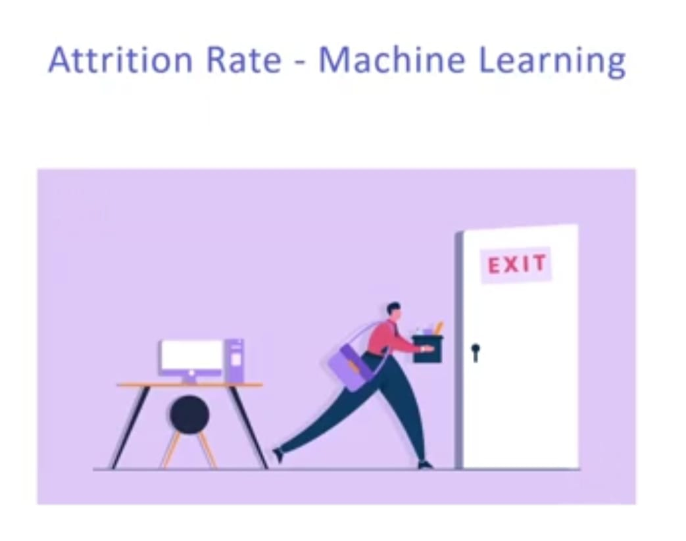

  
 

<h3> Link to Site- https://attrition-rate.herokuapp.com/show_attrition/ </h3>
 
 <i> <h2>  What is Attrition </h2>

<h3><i>A common attrition rate definition refers to employee or staff turnover, but in a broader sense, attrition rate is a calculation of the number of individuals or items that vacate or move out of a larger, collective group that can be an organization, over a specified time frame. A term often used by human resources professionals to determine a company's ability to retain employees. </h2>

 

<h2> Details of the Project

<h3> The Project is divided into three parts
<h3>1. Building a machine learning model to predict attrition among employees.
<h3>2. We build a web app on Django to mount the prediction model.
<h3>3. We deploy the Django project on Heroku through github.

     
  
 
<h2>Machine Learning Model
<h3> So we start off with building a machine learning model (we actually use 3 models and compare which is the best) and train that model using the attrition rate dataset having 900 datapoints. </h3>
    

 

     
  
  <h1> Screenshots </h1>
  <h2> Input Screen </h2>
 
   
  
    
  
<h2> Output Screen </h2> 

   
  
    

### Give It a Star if you liked the project 
